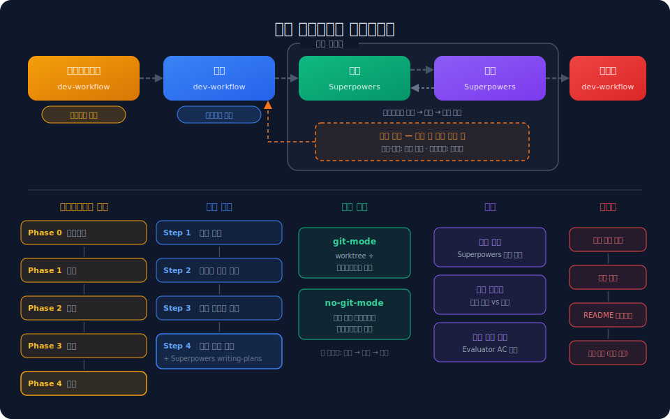
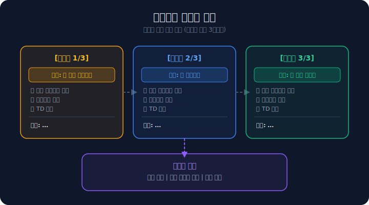
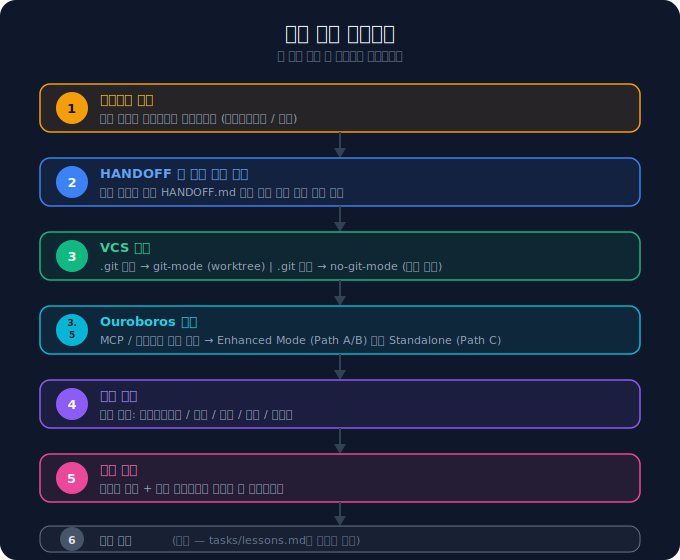
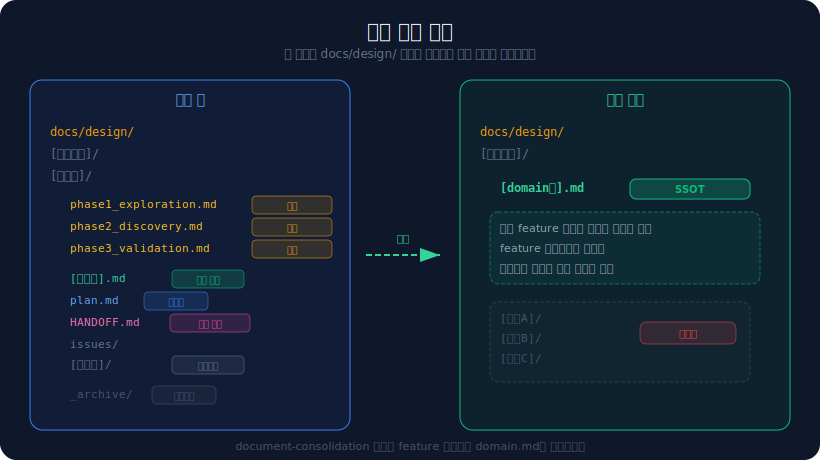

# dev-workflow

> Claude Code plugin for structured development workflows with persona-based feedback loops.

**dev-workflow**는 소프트웨어 개발의 전체 라이프사이클을 **Brainstorm → Plan → Develop → Review → Completion** 5단계로 구조화하는 Claude Code 플러그인입니다. 각 단계에서 다양한 페르소나(Game Designer, Player, Tech Director 등)가 라운드 로빈 방식으로 피드백을 제공하여, 혼자서도 다각적인 관점의 의사결정이 가능합니다.

---

## Workflow Overview

<p align="center">
  
</p>

5단계 파이프라인이 자동으로 감지되어 실행됩니다:

| 단계 | 담당 | 설명 |
|:---:|:---:|---|
| **BRAINSTORM** | dev-workflow | 아이디어 탐색, 요구사항 발굴, 페르소나 피드백 (5 phases) |
| **PLAN** | dev-workflow | 실현 가능성 평가, 설계 방향 수립, 태스크 분해 |
| **DEVELOP** | Superpowers | Git worktree 기반 서브에이전트 구현 (git/no-git 모드) |
| **REVIEW** | Superpowers | 코드 품질 리뷰 + 스펙 적합성 검증 |
| **COMPLETION** | dev-workflow | 문서 취합, README 업데이트, 커밋+푸시 |

---

## Key Features

### Persona Feedback Loop

<p align="center">
  
</p>

Brainstorm과 Plan 단계에서는 **페르소나 기반 피드백 루프**가 활성화됩니다:

- 토픽당 최대 3라운드의 라운드 로빈 토론
- 매 라운드마다 다른 페르소나가 비평 역할(Critical Role)을 담당
- 각 라운드 끝에 합의(Consensus) 도출
- 사용자가 합의를 승인하거나, 추가 라운드를 요청하거나, 방향을 변경 가능

**기본 페르소나:**

| 단계 | 페르소나 |
|---|---|
| Brainstorm (Phase 1-2) | Game Designer, Player |
| Brainstorm (Phase 3) | Game Designer, Player, Tech Director |
| Plan | Architect, Tech Lead, PM |

> 프로젝트별로 `.claude/personas.md`에서 페르소나를 커스터마이징할 수 있습니다.

### Automatic Session Start

<p align="center">
  
</p>

세션이 시작될 때마다 자동으로 6단계 프로토콜이 실행됩니다. 이전 세션의 컨텍스트를 복구하고, 현재 단계를 감지하여 바로 작업을 이어갈 수 있습니다.

### Multi-Session Support (HANDOFF)

작업 중 세션이 종료되어도 걱정 없습니다. `HANDOFF.md`를 저장하면 다음 세션에서 자동으로 감지하여 중단 지점부터 이어서 진행합니다.

```
"핸드오프 저장해줘" → HANDOFF.md 생성 → 세션 종료 → 새 세션 시작 → 자동 복구
```

### Git / Non-Git Support

| 환경 | 동작 |
|---|---|
| `.git` 존재 (git-mode) | Superpowers worktree + subagent 방식 |
| `.git` 없음 (no-git-mode) | 파일 기반 체크포인트, worktree 스킵 |

---

## Installation

### Prerequisites

[Superpowers](https://github.com/obra/superpowers) 플러그인이 먼저 설치되어 있어야 합니다:

```bash
/plugin install superpowers@claude-plugins-official
```

### Install dev-workflow

```bash
/plugin marketplace add sangteak/dev-workflow
/plugin install dev-workflow@sangteak-dev-workflow
```

### Update

```bash
/plugin update dev-workflow@sangteak-dev-workflow
```

### Manual Installation (Alternative)

마켓플레이스 설치가 동작하지 않을 경우:

```bash
git clone https://github.com/sangteak/dev-workflow.git
```

프로젝트의 `.claude/settings.json`에 추가:

```json
{
  "extraKnownMarketplaces": {
    "dev-workflow": {
      "source": {
        "source": "local",
        "directory": "/path/to/dev-workflow"
      }
    }
  },
  "enabledPlugins": {
    "dev-workflow@dev-workflow": true
  }
}
```

---

## Quick Start

### 1. 새 기능 브레인스토밍 시작

세션을 시작하고 자연어로 요청하면 됩니다:

```
"인벤토리 시스템을 브레인스토밍하고 싶어"
```

워크플로우가 자동으로 BRAINSTORM 단계를 감지하고, 페르소나를 확정한 뒤 5단계 브레인스토밍을 시작합니다.

### 2. 이전 작업 이어가기

새 세션을 시작하면 자동으로 `HANDOFF.md`를 탐색합니다:

```
> HANDOFF가 감지되었습니다:
> 1. inventory-system (Phase 2: Discovery)
> 2. combat-system (Plan: Feasibility)
> 0. 새 작업 시작
>
> 어느 작업을 이어서 진행할까요?
```

### 3. 마무리하기

개발이 완료되면 자연어로 마무리를 요청합니다:

```
"마무리해줘"
```

자동으로 문서 취합 → README 업데이트 판단 → 커밋+푸시 순서로 진행됩니다.

---

## Workflow Stages in Detail

### BRAINSTORM (5 Phases)

| Phase | 이름 | 산출물 | 설명 |
|:---:|---|---|---|
| 0 | Category | - | kebab-case 카테고리 결정 |
| 1 | Exploration | `phase1_exploration.md` | 제약 없이 요구사항 탐색 |
| 2 | Discovery | `phase2_discovery.md` | 미정의 영역 발굴 및 보완 |
| 3 | Validation | `phase3_validation.md` | 기술적 실현 가능성 검증 |
| 4 | Consolidation | `[feature].md` | 10섹션 표준 설계 문서 생성 |

- Phase 1~3에서 페르소나 피드백 루프 활성화
- Phase 파일은 생성 후 **불변** (수정 불가, 스냅샷 역할)
- Phase 4에서 모든 내용을 통합한 설계 문서(SSOT) 자동 생성

### PLAN (4 Steps)

| Step | 내용 |
|:---:|---|
| 1 | 브레인스토밍 문서 분석 |
| 2 | OPEN_QUESTIONS 해소 |
| 3 | 실현 가능성 평가 (Architect, Tech Lead, PM) |
| 4 | 설계 방향 수립 → Superpowers `writing-plans` 실행 |

- 요구사항별 판정: ✅ FEASIBLE / ⚠️ CAUTION / 🚫 RENEGOTIATE
- RENEGOTIATE 항목은 사용자 결정 없이 진행하지 않음
- CAUTION 항목은 페르소나 피드백 루프를 통해 접근 방식 합의

### DEVELOP

Superpowers `subagent-driven-development`에 위임됩니다:

- **git-mode**: worktree를 생성하여 격리된 환경에서 구현
- **no-git-mode**: 현재 디렉토리에서 직접 작업, 파일 기반 체크포인트
- 모든 태스크 완료 후 커밋하지 않고 Completion Protocol로 전달

### REVIEW

Superpowers `requesting-code-review`에 위임됩니다:

- Code Quality Review (코드 품질)
- Spec Compliance Review (설계 문서 대비 적합성)

### COMPLETION

마무리 트리거 감지 시 자동 실행:

1. **문서 취합** — phase/plan 파일을 설계 문서에 통합, `_archive/`로 이동
2. **README 영향 판단** — 변경 내용에 따라 README 업데이트 제안
3. **커밋+푸시 제안** — 사용자 확인 후 실행

---

## File Structure

<p align="center">
  
</p>

```
docs/design/[category]/[feature]/
├── phase1_exploration.md   ← Phase 1 완료 시 생성, 불변
├── phase2_discovery.md     ← Phase 2 완료 시 생성, 불변
├── phase3_validation.md    ← Phase 3 완료 시 생성, 불변
├── [feature].md            ← 최종 설계 문서 (SSOT)
├── plan.md                 ← PLAN 단계에서 생성
├── HANDOFF.md              ← 세션 중단 시 저장 (임시)
├── issues/                 ← 핫픽스 서브워크플로우 (선택)
│   └── [issue-name]/
└── _archive/               ← 개발 완료 후 phase/plan 파일 이동
```

**보조 파일:**

```
.claude/personas.md         ← 프로젝트별 페르소나 오버라이드 (선택)
tasks/lessons.md            ← 세션 간 학습 누적 (자기개선 루프)
tasks/todo.md               ← Superpowers writing-plans 산출물
```

---

## Skills Reference

| Skill | 역할 | 호출 시점 |
|---|---|---|
| `workflow-orchestrator` | 전체 라이프사이클 관리, 단계 감지 | 매 세션 시작 (자동) |
| `persona-resolution` | 단계별 페르소나 확정 | 세션 시작 프로토콜 Step 1 |
| `brainstorming` | 5단계 브레인스토밍 + 피드백 루프 | BRAINSTORM 단계 진입 시 |
| `plan-stage` | 실현 가능성 평가, 설계 방향 수립 | PLAN 단계 진입 시 |
| `context-handling` | HANDOFF.md 생성/복구 | 세션 시작 또는 사용자 요청 시 |
| `development-principles` | 개발 철학, 자기개선 루프 | 전 단계 참조 |
| `document-consolidation` | 문서 통합 및 아카이브 | COMPLETION 단계 |
| `design-doc-index` | 설계 문서 색인 및 크로스레퍼런스 | BRAINSTORM/PLAN 중 사용자 요청 시 |

---

## Configuration

### Custom Personas

프로젝트 루트에 `.claude/personas.md`를 생성하여 페르소나를 커스터마이징할 수 있습니다:

```markdown
## brainstorm
- 🎮 Game Designer: 게임 메커니즘과 플레이어 경험 전문가
- 👤 Player: 최종 사용자 관점 대변
- 🔧 Tech Director: 기술적 실현 가능성 검증

## plan
- 🏛️ Architect: 시스템 아키텍처 설계
- 🔧 Tech Lead: 기술 리더십 및 구현 전략
- 📋 PM: 일정, 리소스, 리스크 관리
```

### Self-Improvement Loop

세션에서 수정을 받을 때마다 `tasks/lessons.md`에 자동으로 교훈이 기록됩니다. 다음 세션 시작 시 이 교훈을 내부적으로 읽고 같은 실수를 반복하지 않습니다.

---

## FAQ

**Q: Superpowers 없이도 사용할 수 있나요?**
A: BRAINSTORM과 PLAN 단계는 독립적으로 동작합니다. 하지만 DEVELOP과 REVIEW 단계는 Superpowers가 필요합니다.

**Q: Git이 없는 프로젝트에서도 동작하나요?**
A: 네. `.git`이 없으면 자동으로 no-git-mode로 전환되어 worktree 없이 파일 기반으로 진행합니다.

**Q: 페르소나를 바꿀 수 있나요?**
A: 세션 시작 시 페르소나 확정 단계에서 변경할 수 있고, `.claude/personas.md`로 프로젝트별 기본값을 설정할 수 있습니다.

**Q: 여러 기능을 동시에 작업할 수 있나요?**
A: 네. 각 기능은 `docs/design/[category]/[feature]/` 하위에 독립적으로 관리되며, HANDOFF.md를 통해 세션 간 전환이 가능합니다.

---

## License

MIT
